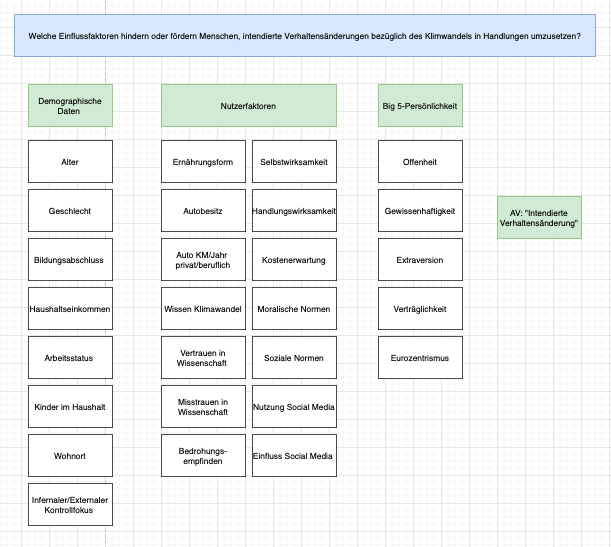

# Intendierte Verhaltensänderung im Klimawandel

## Teammitglieder

-   Gianna Betz
-   Blerona Bytyqi
-   Kyra Heiden
-   Elena Hahn

# Forschungsfragen

Welche Einflussfaktoren hindern oder fördern Menschen, intendierte
Verhaltensänderungen bezüglich des Klimawandels in Handlungen
umzusetzen?

## Faktorenraum

Soziale Medien

## Operationalisierungen

-   Alter: Freitext
-   Geschlecht:m/w/d
-   Bildungsabschluss:Auswahlmöglichkeiten
-   Haushaltseinkommen:Auswahlmöglichkeiten
-   Arbeitstatus: Auswahlmöglichkeiten
-   Kinder im Haushalt: Auswahlmöglichkeiten (keine/ 1/ 2/ 3/ mehr)
-   Wohnort: Auswahlmöglichkeiten (Stadt/Land etc.)
-   Ernährungsform:Auswahlmöglichkeit (vegan/ vegetarisch/ alles/
    pescetarisch etc.)
-   Autobesitz: (ja/nein)
-   Auto Km: Freitext
-   Auto Jahr: Freitext
-   Auto Privat: ja/nein
-   Auto beruflich: ja/nein
-   Wissen Klimawandel: Likertskala
-   Vertrauen in Wissenschaft: Likertskala
-   Misstrauen in Wissenschaft: Likerstskala
-   Bedrohungsempfinden: Likertskala
-   Selbstwirksamkeit: Likertskala
-   Handlungswirksamkeit: Likertskala
-   Kostenerwartung:
-   moralische Normen:
-   soziale Normen:
-   Nutzung Social Media: Likertskala
-   Einfluss Social Media: Likertskala

## R Markdown
