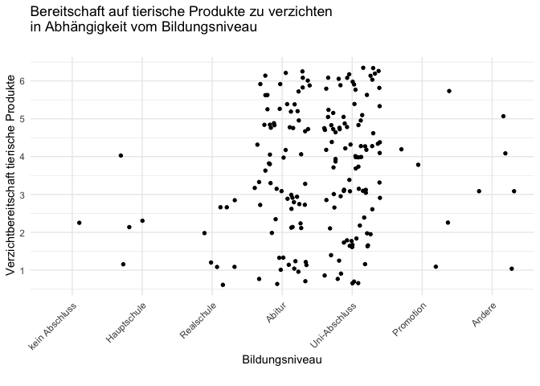
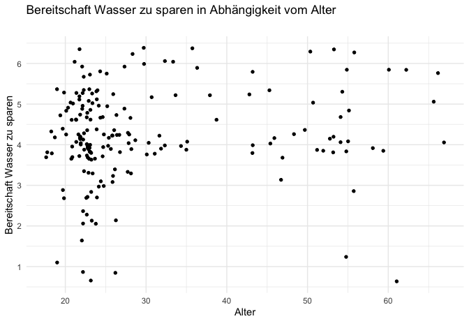
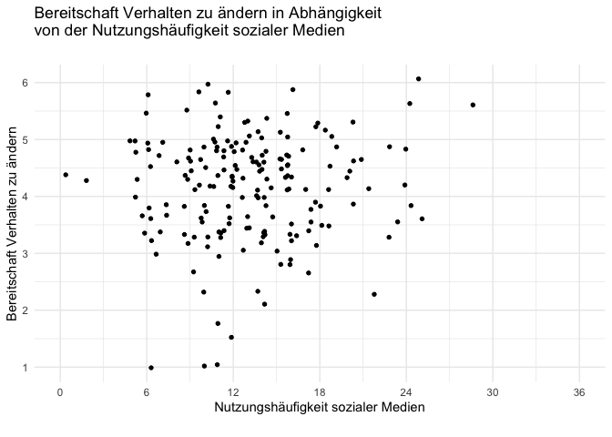
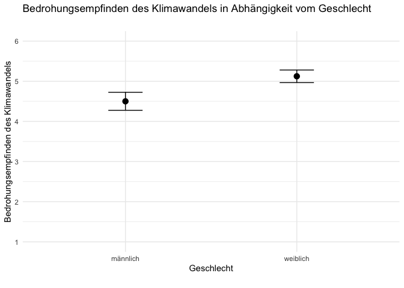

# Intendierte Verhaltensänderung im Klimawandel

## Teammitglieder

-   Gianna Betz
-   Blerona Bytyqi
-   Kyra Heiden
-   Elena Hahn

# Forschungsfragen

Welche Einflussfaktoren hindern oder fördern Menschen, intendierte
Verhaltensänderungen bezüglich des Klimawandels in Handlungen
umzusetzen?

## Faktorenraum

Soziale Medien

## Operationalisierungen

**Demographische Daten**

-   Alter: Freitext
-   Geschlecht:m/w/d
-   Bildungsabschluss:Auswahlmöglichkeiten
-   Haushaltseinkommen:Auswahlmöglichkeiten
-   Arbeitstatus: Auswahlmöglichkeiten
-   Kinder im Haushalt: Auswahlmöglichkeiten (keine/ 1/ 2/ 3/ mehr)
-   Wohnort: Auswahlmöglichkeiten (Stadt/Land etc.)
-   Internaler/Externaler Kontrollfokus:

**Nutzerfaktoren**

-   Ernährungsform:Auswahlmöglichkeit (vegan/ vegetarisch/ alles/
    pescetarisch etc.)
-   Autobesitz: (ja/nein)
-   Auto Km: Freitext
-   Auto Jahr: Freitext
-   Auto Privat: ja/nein
-   Auto beruflich: ja/nein
-   Wissen Klimawandel: Likertskala
-   Vertrauen in Wissenschaft: Likertskala
-   Misstrauen in Wissenschaft: Likerstskala
-   Bedrohungsempfinden: Likertskala
-   Selbstwirksamkeit: Likertskala
-   Handlungswirksamkeit: Likertskala
-   Kostenerwartung:
-   moralische Normen:
-   soziale Normen:
-   Nutzung und Einfluss von Social Media: selbsterstellte
    Einfachauswahl / Matrix / Likertskala (4 Items)

**Big 5-Persönlichkeit**

-   Offenheit:
-   Gewissenhaftigkeit:
-   Extraversion:
-   Verträglichkeit:
-   Eurozentrismus:

Unser Text: Viele Menschen unterstützen zwar die Idee des Umweltschutzes
und haben die Absicht, nachhaltiger zu leben, aber ihre tatsächlichen
Handlungen entsprechen oft nicht diesen Absichten. Wenn wir die
Diskrepanz zwischen Absicht und Verhalten verstehen, können gezieltere
Informationskampagnen, Anreize und Bildungsprogramme entwickelt werden,
um die Umsetzung nachhaltiger Praktiken zu fördern. Es ermöglicht auch,
Hindernisse zu identifizieren, die Menschen davon abhalten, ihre
Absichten in die Tat umzusetzen, und gezielte Lösungen einzuführen, um
diese Barrieren zu überwinden. In Bezug auf den Klimawandel ist es
entscheidend, dass individuelle Absichten zur Reduzierung von
Treibhausgasemissionen in konkrete Maßnahmen umgesetzt werden. Nur so
können wir als Gesellschaft die notwendigen Veränderungen herbeiführen,
um den Klimawandel einzudämmen und nachhaltiger zu leben.

**Quelle:** Williams, M. N., & Jaftha, B. A. (2020). Perceptions of
powerlessness are negatively associated with taking action on climate
change: A preregistered replication. Ecopsychology, 12(4)

**Deskriptive Statistik**

    ##                        alpha mean   sd median  min  max
    ## Verhaltensaenderung     0.81 4.16 0.94   4.33 1.00 6.00
    ## Vertrauen_Wissenschaft  0.76 2.81 0.63   2.83 1.56 4.78
    ## Sorgen_Klimawandel      0.87 4.87 0.91   5.00 1.50 6.00
    ## Klimaschutz             0.81 4.14 0.74   4.17 1.92 5.83
    ## Moral                   0.87 4.87 0.95   5.00 1.00 6.00

    ##          mean    sd median min max
    ## age     30.15 12.38     24  18  67
    ## gender*  2.65  0.49      3   1   3
    ## edu*     5.54  0.86      6   2   8

**3 Zusammenhangshypothesen**

-   Je höher das Bildungsniveau desto höher ist die Bereitschaft
    tierische Podukte zu vermeiden

<!-- -->

    ## 
    ##  Kendall's rank correlation tau
    ## 
    ## data:  df$ccbi1 and as.numeric(df$edu)
    ## z = 1.7752, p-value = 0.07586
    ## alternative hypothesis: true tau is not equal to 0
    ## sample estimates:
    ##       tau 
    ## 0.1096749

-   Je höher das Alter desto höher ist die Bereitschaft Wasser zu sparen

<!-- -->

    ## 
    ##  Kendall's rank correlation tau
    ## 
    ## data:  (df$ccbi5) and (df$age)
    ## z = 1.2559, p-value = 0.2091
    ## alternative hypothesis: true tau is not equal to 0
    ## sample estimates:
    ##        tau 
    ## 0.07150035

-   Es gibt einen Zusammenhang zwischen der Nutzungshäufigkeit sozialer
    Medien und der Bereitschaft das Verhalten zu ändern

<!-- -->

    ## 
    ##  Pearson's product-moment correlation
    ## 
    ## data:  df$Verhaltensaenderung and df$NHSM
    ## t = 0.97448, df = 184, p-value = 0.3311
    ## alternative hypothesis: true correlation is not equal to 0
    ## 95 percent confidence interval:
    ##  -0.0729768  0.2133349
    ## sample estimates:
    ##        cor 
    ## 0.07165493

**Zusammenhangshypothese lineare Regression**

-   Die Bereitschaft das Verhalten zu ändern ist abhängig von dem
    Misstrauen in die Wissenschaft und dem Bedrohungsempfinden

<!-- -->

    ## 
    ##  LINEAR REGRESSION
    ## 
    ##  Model Fit Measures                                                                         
    ##  ────────────────────────────────────────────────────────────────────────────────────────── 
    ##    Model    R            R²           Adjusted R²    F           df1    df2    p            
    ##  ────────────────────────────────────────────────────────────────────────────────────────── 
    ##        1    0.5093147    0.2594015      0.2553765    64.44770      1    184    < .0000001   
    ##        2    0.5394638    0.2910212      0.2832728    37.55887      2    183    < .0000001   
    ##  ────────────────────────────────────────────────────────────────────────────────────────── 
    ## 
    ## 
    ##  Model Comparisons                                                            
    ##  ──────────────────────────────────────────────────────────────────────────── 
    ##    Model         Model    ΔR²           F           df1    df2    p           
    ##  ──────────────────────────────────────────────────────────────────────────── 
    ##        1    -        2    0.03161976    8.161622      1    183    0.0047739   
    ##  ──────────────────────────────────────────────────────────────────────────── 
    ## 
    ## 
    ##  MODEL SPECIFIC RESULTS
    ## 
    ##  MODEL 1
    ## 
    ##  Model Coefficients - Verhaltensaenderung                                                       
    ##  ────────────────────────────────────────────────────────────────────────────────────────────── 
    ##    Predictor             Estimate     SE            t           p             Stand. Estimate   
    ##  ────────────────────────────────────────────────────────────────────────────────────────────── 
    ##    Intercept             1.6134765    0.32252876    5.002582     0.0000013                      
    ##    Sorgen_Klimawandel    0.5224131    0.06507443    8.027932    < .0000001          0.5093147   
    ##  ────────────────────────────────────────────────────────────────────────────────────────────── 
    ## 
    ## 
    ##  MODEL 2
    ## 
    ##  Model Coefficients - Verhaltensaenderung                                                            
    ##  ─────────────────────────────────────────────────────────────────────────────────────────────────── 
    ##    Predictor                 Estimate      SE            t            p            Stand. Estimate   
    ##  ─────────────────────────────────────────────────────────────────────────────────────────────────── 
    ##    Intercept                  3.0219191    0.58581660     5.158473    0.0000006                      
    ##    Sorgen_Klimawandel         0.4107082    0.07486586     5.485920    0.0000001          0.4004105   
    ##    Vertrauen_Wissenschaft    -0.3078789    0.10776846    -2.856855    0.0047739         -0.2085183   
    ##  ───────────────────────────────────────────────────────────────────────────────────────────────────

**3 Unterschiedshypothesen**

-   Menschen, die sich vegan ernähren sind eher dazu bereit ihr
    Verhalten zu ändern als Menschen die sich nicht vegan ernähren

<!-- -->

    ## 
    ##  Welch Two Sample t-test
    ## 
    ## data:  gruppe_vegan$Verhaltensaenderung and gruppe_nicht_vegan$Verhaltensaenderung
    ## t = 4.397, df = 5.9153, p-value = 0.004741
    ## alternative hypothesis: true difference in means is not equal to 0
    ## 95 percent confidence interval:
    ##  0.4726439 1.6680968
    ## sample estimates:
    ## mean of x mean of y 
    ##  5.194444  4.124074

-   Männer und Frauen unterscheiden sich bezüglich ihrer Bereitschaft
    das Verhalten zu ändern

<!-- -->

    ## 
    ##  Welch Two Sample t-test
    ## 
    ## data:  gruppe_frauen$Verhaltensaenderung and gruppe_maenner$Verhaltensaenderung
    ## t = 1.5018, df = 104.06, p-value = 0.1362
    ## alternative hypothesis: true difference in means is not equal to 0
    ## 95 percent confidence interval:
    ##  -0.07487278  0.54225937
    ## sample estimates:
    ## mean of x mean of y 
    ##  4.236339  4.002646

-   Menschen die mehr über den Klimawandel wissen ändern eher ihr
    Verhalten als Menschen die weniger über den Klimawandel wissen

<!-- -->

    ## 
    ##  Welch Two Sample t-test
    ## 
    ## data:  gruppe_wissend$Verhaltensaenderung and gruppe_unwissend$Verhaltensaenderung
    ## t = 1.0612, df = 61.158, p-value = 0.2928
    ## alternative hypothesis: true difference in means is not equal to 0
    ## 95 percent confidence interval:
    ##  -0.1614334  0.5266142
    ## sample estimates:
    ## mean of x mean of y 
    ##  4.198851  4.016260

**Unterschiedshypothese MANOVA**

-   Geschlecht (männlich / weiblich) und Bildung haben einen Einfluss
    auf das Bedrohungsempfinden und die Bereitschaft das Verhalten zu
    ändern

<!-- -->

    ## 
    ##  MANCOVA
    ## 
    ##  Multivariate Tests                                                                           
    ##  ──────────────────────────────────────────────────────────────────────────────────────────── 
    ##                                        value          F             df1    df2    p           
    ##  ──────────────────────────────────────────────────────────────────────────────────────────── 
    ##    gender        Pillai's Trace        0.117474305    10.4492515      2    157    0.0000549   
    ##                  Wilks' Lambda           0.8825257    10.4492515      2    157    0.0000549   
    ##                  Hotelling's Trace     0.133111484    10.4492515      2    157    0.0000549   
    ##                  Roy's Largest Root    0.133111484    10.4492515      2    157    0.0000549   
    ##                                                                                               
    ##    edu           Pillai's Trace        0.018381855     1.4699969      2    157    0.2330732   
    ##                  Wilks' Lambda           0.9816181     1.4699969      2    157    0.2330732   
    ##                  Hotelling's Trace     0.018726075     1.4699969      2    157    0.2330732   
    ##                  Roy's Largest Root    0.018726075     1.4699969      2    157    0.2330732   
    ##                                                                                               
    ##    gender:edu    Pillai's Trace        0.004090220     0.3224010      2    157    0.7248861   
    ##                  Wilks' Lambda           0.9959098     0.3224010      2    157    0.7248861   
    ##                  Hotelling's Trace     0.004107019     0.3224010      2    157    0.7248861   
    ##                  Roy's Largest Root    0.004107019     0.3224010      2    157    0.7248861   
    ##  ──────────────────────────────────────────────────────────────────────────────────────────── 
    ## 
    ## 
    ##  Univariate Tests                                                                                         
    ##  ──────────────────────────────────────────────────────────────────────────────────────────────────────── 
    ##                  Dependent Variable     Sum of Squares    df     Mean Square    F             p           
    ##  ──────────────────────────────────────────────────────────────────────────────────────────────────────── 
    ##    gender        Sorgen_Klimawandel         13.9290920      1     13.9290920    20.8587818    0.0000099   
    ##                  Verhaltensaenderung         2.2647793      1      2.2647793     2.8028511    0.0960752   
    ##    edu           Sorgen_Klimawandel          1.9666189      1      1.9666189     2.9450071    0.0881033   
    ##                  Verhaltensaenderung         0.6164230      1      0.6164230     0.7628743    0.3837560   
    ##    gender:edu    Sorgen_Klimawandel          0.1369479      1      0.1369479     0.2050792    0.6512732   
    ##                  Verhaltensaenderung         0.5151794      1      0.5151794     0.6375770    0.4257881   
    ##    Residuals     Sorgen_Klimawandel        105.5093508    158      0.6677807                              
    ##                  Verhaltensaenderung       127.6682616    158      0.8080270                              
    ##  ────────────────────────────────────────────────────────────────────────────────────────────────────────

**Absatz zur Poweranalyse**

-   Man braucht bei einer schwacher Korrelation(r=0.1) ca. 782
    Proband:innen um eine Power von 0.8 zu erhalten

-   Man braucht bei einer mittleren Korrelation(r=0.3) ca. 84
    Proband:innen um eine Power von 0.8 zu erhalten

-   Man braucht bei einer starken Korrelation(r=0.5) ca. 28
    Proband:innen um eine Power von 0.8 zu erhalten

-   Bei 140 Proband:innen muss der Korrelationseffekt = 0,23 sein damit
    der Effekt nicht übersehen werden kann

## R Markdown
